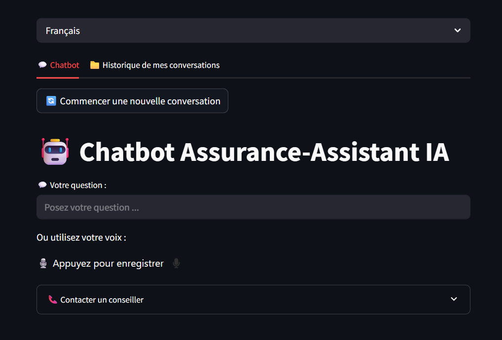
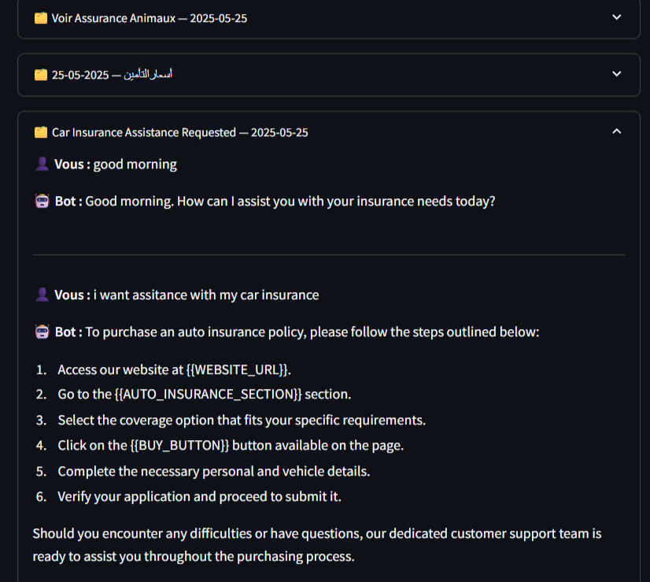
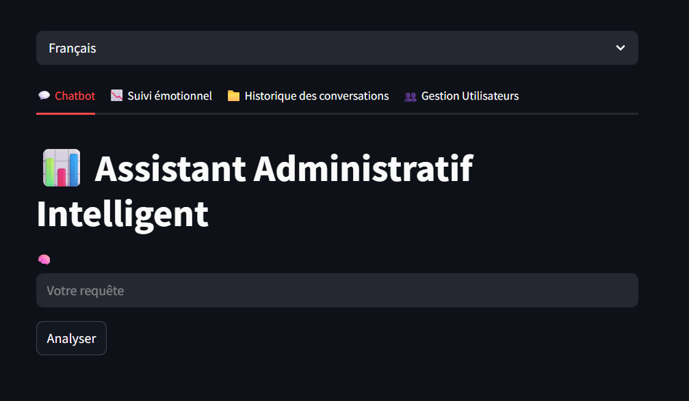
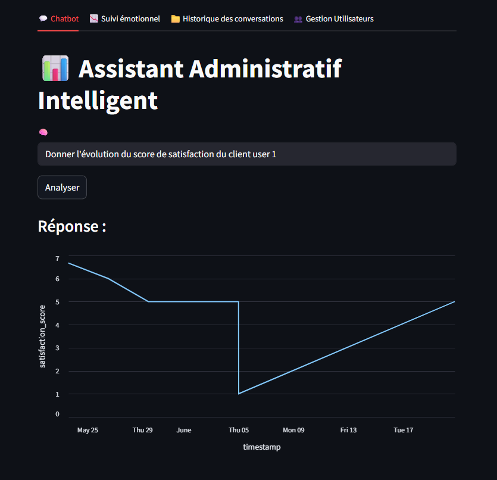

# 🧠AI Chatbot Platform for Insurance Services

> **MediBot** is an intelligent, multimodal chatbot platform built with Python.  
> It’s designed to enhance **insurance services** through voice and text interactions, emotion analysis, and data-driven dashboards.  

## 🧩 Overview

MediBot offers two main modules:  

- 👥 **User Module** — customers interact with the chatbot using **voice or text**, view their conversation history, and receive emotion-aware responses.  
- 🧑‍💼 **Admin Module** — decision-makers explore **KPIs, dashboards, and sentiment analytics**, manage users, and monitor global activity.

---
## 🚀 Key Features
### 🗣️ Multimodal Interaction

- Supports **Text** 💬 and  **Voice** 🎙️ input using Speech-to-Text (STT) and Text-to-Speech (TTS) technologies.

- Provides natural, human-like responses with audio output.

### 💬 Conversational Intelligence

- Real-time **emotion & intent detection** (e.g., *happy, sad, angry, neutral*).
- Generates automatic satisfaction scores based on emotion trends.

### 🧠 Sentiment & Emotion Monitoring

- Tracks sentiment evolution across each conversation.

- Displays **interactive graphs** showing emotional evolution.

### 🔐 Secure Authentication
- **JWT-based authentication** with role-based access control:

  - 🧍 **Users** — interact with the bot and review their conversation history.

  - 🧑‍💼 **Admins** — access advanced dashboards and user management tools.

### 💾 Persistent Data Storage

- Stores conversations, users, and sentiment scores in a SQLite database.

- Enables filtered queries and historical analysis.


---


## 🧍‍♂️ User Module

<details>
<summary>🧭 Click to expand</summary>

### Features
- Interact with MediBot via **text** or **voice commands**.  
- Enjoy **real-time voice replies** through Text-to-Speech (TTS).  
- Access **chat history** and review previous interactions.  
- Experience adaptive responses based on emotional tone.  

### Example User Flow
1. Log in with credentials.  
2. Start a conversation (voice or text).  
3. MediBot detects emotions, intent, and provides contextual responses.  
4. View conversation history revisit previous conversations.

 

------------------------------------------------------------------------------------------------------


 


</details>

---

## 🧑‍💼 Admin Module (Decision-Makers Dashboard)
The admin area empowers decision-makers with data-driven insights:
<details>
<summary>📊 Click to expand</summary>

### 📊 KPI & Analytics

- View real-time **metrics and visual dashboards** (user activity, sentiment trends, satisfaction scores).  
- Access aggregated analytics across all users and sessions.

### 🧾 Conversations Management

- Access a complete list of all users’ conversations.

- Filter, search, and export conversation histories.

### 👥 User Management

- Add 🟢, modify 🟡, or delete 🔴 users.  
- Manage **roles and permissions** dynamically.

### 😊 Sentiment Monitoring

- Visual dashboards for sentiment analysis across users and time periods.

- Identify negative trends or dissatisfaction in customer interactions.

  

------------------------------------------------------------------------------------------------------

  

</details>

---

### ⚙️ Technical Details

MediBot is built using a modular, scalable, and RAG-enabled AI architecture to provide context-aware and accurate responses.

### 🔹 Core AI Components

- Retrieval-Augmented Generation (RAG)

Uses LangChain to orchestrate retrieval of relevant information and generate responses.

Enhances factual accuracy by combining dataset knowledge with LLM generation.

- Vector Store & Semantic Search

Embeddings generated via SentenceTransformers (all-MiniLM-L6-v2 or multilingual variants).

FAISS vector store enables fast semantic search on the dataset (question, intent, category, response).

- Large Language Model Integration

Groq LLM generates natural, context-aware responses based on retrieved passages.

Prompt templates adapt dynamically to the user’s language using get_system_prompt(language).

- Multilingual Support

Detects input language automatically.

Retrieval and generation respect the detected language, ensuring consistent responses in French, English, or other languages.

- Observability & Monitoring

Langfuse tracks every RAG interaction: user query, retrieved context, LLM output, and metrics.

Enables debugging, analytics, and continuous improvement of the chatbot’s accuracy.


---
## 🧱 Project Structure

AI-chatbot/
├── main.py

├── utils

│ └── lang.py

├── dataset

│ ├── dataset.csv

├── database/

│ └── databaset.db

│ └── conversations.db

├── requirements.txt

├── README.md

## 📦 Installation

1. **Clone the repository**:

```bash
git clone https://github.com/Karim-ElKadhi/AI-chatbot.git
cd AI-chatbot
pip install -r requirements.txt
python app/main.py

## Access the interface

🧍 User Dashboard → http://localhost:5000/user

🧑‍💼 Admin Dashboard → http://localhost:5000/admin
```
📄 License

This project is licensed under the MIT License.
